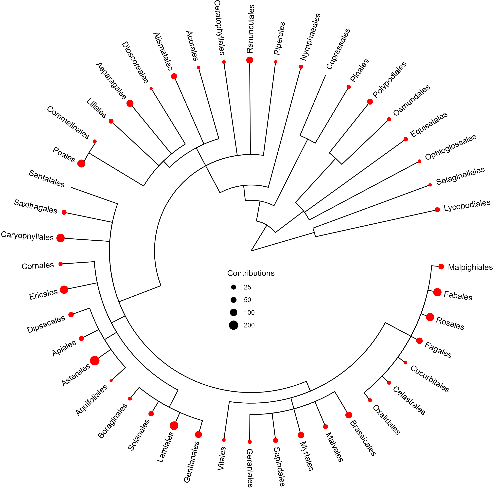
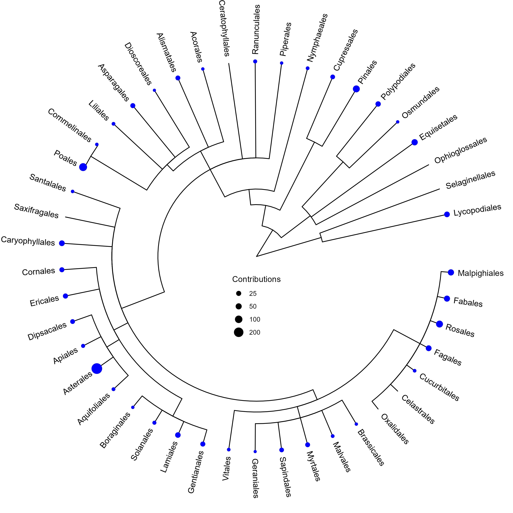

```{r setup, include=FALSE}
knitr::opts_chunk$set(echo = FALSE, warning = FALSE, message = FALSE, fig.align = 'center')

library(tidyverse)

```

\noindent Lillian Holl\
Research Paper\
ENSC 381\
`r Sys.Date()`\

\centerline{Biannual Peaks to Herbarium Contributions Coincide with Potential Collector Roles:}
\centerline{ A Case Study of the Donald W. Davidson Herbarium (SUWS)}

\noindent{\textbf{Introduction}}

  \indent An herbarium is a library of pressed and dried plants. The physical collection of specimens is built through the process of collection named on the lower left in Figure A. During this process, collectors identify plants out in the world and record information about the plant, such as species, who is collecting it, when and where it was collected, and the habitat it was collected in. Typically, any plant can be added to an herbarium; however, unique species, locations, or times of year may add more depth to the overall collection. The plant is then picked and pressed between newspaper sheets to dry, and an herbarium label is created with the gathered information. The pressed plant and herbarium label are then mounted on an herbarium sheet, and the specimen is accessioned, or formally integrated, into the collection.\
  \indent The digital database of specimens in an herbarium is built through the process of digitization named on the upper left of Figure A. During digitization, the information from the herbarium label is transcribed and entered into a spreadsheet-like format. Each row corresponds to one specimen. Digitized records of herbarium specimens can be used for scientific studies, but they are not a perfect source of biodiversity information. The imperfections are known as biases, and they are the result of the digitization and collection processes above. Digitization may affect representation in a database[@williams2019] because not all physical specimens will have a corresponding database entry. Efforts to bring “museum specimens out of the cabinet and onto the internet”[@soltis2017] have, for example, revealed collections that were bigger than previously thought[@smedt2024] and contributed a concentration of specimens specific to globally underrepresented geographical areas.[@davis2023; @klopper2025] The reverse situation where digitized information about a specimen is maintained in a database despite no physical specimen may also introduce biases. These specimen records cannot be verified by looking at the herbarium label and are difficult to identify in unmaintained collection databases (L. Holl, unpublished code).\
  \indent Collection biases are a more difficult problem to address. These biases are artifacts of a physical collection’s contribution history, and are a result of past opportunistic collection by botanists going out when and where they can according to funded projects, time limitations, and personal preference. For example, temporal biases are a form of collection biases that deal with over- or under-represented periods of time in a collection. Varied collection efforts over an herbarium’s entire history leads to peaks and troughs in collection activity year over year.[@schmidt2025; @daru2018; @delisle2003] Herbarium collections may also have temporal bias on an annual basis, where some months have more collections than others. This second form of temporal basis is typically related to climate because more plants are naturally collected during the growing season.[@schmidt2025; @daru2018]\
  \indent Knowledge of the temporal biases present in a particular collection or group of specimens informs how they can be used for scientific study. For example, temporal variability in specimen collection may impact the ability of herbariums to serve as historical references of species turnover in plant communities.[@haque2018] Temporal biases also play a role in phenological studies, where botanists look at the timing of when natural events occur. Botanists tend to collect showy flowers, and such a collection bias may also result in a temporal bias. For example, estimates of flowering days derived from herbarium data are typically later than methods that use other data sources because of collector preferences.[@willis2017; @yang2022]\
  \indent The Donald W. Davidson Herbarium, located at the University of Wisconsin - Superior in the Department of Natural Sciences, is a small herbarium with both digitization and collection biases. This collection, registered on the Index Herbariorum with the four-letter code SUWS, contains approximately 10,000 specimens as of February 2025.[@thiersupdatedcontinuously] However, only about half of the physical specimens have digital records available on WisFlora, the Online Virtual Flora of Wisconsin hosted by the Consortium of Wisconsin Herbaria.[@consortiumofwisconsinherbaria2025]  I previously completed a project that analyzed the contributions of seven prolific contributors to the collection, and noticed a temporal bias in annual contributions represented top center of Figure A. It is unusual for a collection to have a second peak of contributions in the fall as plants begin to die off and those in charge of university collections become busy with academic commitments.\
  \indent Further investigation is needed to determine whether the bump in September contributions to the herbarium is a result of unique local phenology or SUWS-specific collection biases potentially driven by student or classroom contributions. Analysis of the current SUWS database will provide detailed answers on whether September contributors are also contributing at other times of the year as well as the spatial and taxonomic differences in contributions made during this month.

\includepdf[pages=-]{../SepPeak/MARKDOWN/PDFAppend/Conceptual_Model_of_Collector_Role_Biases.drawio}

\noindent{\textbf{Methods}}

  \indent Raw data was cleaned to create a datset to draw from as detailed in the upper row of Figure B. A spreadsheet of 5,290 SUWS records in Darwin Core format was downloaded from WisFlora.[@consortiumofwisconsinherbaria2025] Data wrangling was done primarily in R with base R and the package tidyverse.[@wickham2023] 43 columns that had NAs for all records, 7 with the same entry for all records, and 8 with very little to offer for analysis were removed. There were 32 specimens whose entry in the database was duplicated (for a total of 64 affected records); 29 records were kept when verified against the original physical herbarium label and the rest removed from the data set. Additionally, the dataset was filtered to remove 157 records that had no entry in the month column. 5,099 records remained after these initial cleaning steps, and the dataframe was called SUWS_clean.\
  \indent Further data wrangling was necessary for individual analyses and visualizations within this project. Visualizations unless otherwise noted were done with the package ggplot2.[@wickham2026] As noted in Figure B, two datasets were created from SUWS_clean for modality tests and monthly visualizations. SUWS_primary had only the first collector associated with each of the 5,099 records, while SUWS_sep_collectors repeated records if there was more than one collector listed (6,328 records). Using the diptest package,[@maechler2025] Hartigan's Dip Test was applied to the monthly data to assess modality. \textbf{Modality} describes how many peaks in modes there are in data, and data can be unimodal with one peak, bimodal with two peaks, and so on.[@2026] Because of the similarity in results of Hartigan's Dip Test between the two datasets and a nemphasis on collector activity over specimen numbers, the SUWS_sep_collectors dataset was used for the rest of the project.\
  \indent Preliminary investigation of the September peak in collections relied on visualizations as noted in Figure B to the left of SUWS_sep_collectors. To graph the collection sizes of September collectors, SUWS_sep_collectors was temporarily filtered to include only observations from September. Numbers and percentage of the halfway approximation were determined directly from the data frame and added manually to the plot. In this case, the \textbf{percentage} describes a ratio of the number of specimens that is proportional to 100,[@2026a] and is a visualization of whether the collection is built by a few individuals when paired with a bar graph of individual collector contributions. To examine annual trends related to the most prolific collectors across the entire collection who also made contributions in September, SUWS_sep_collectors was further filtered by a factor separating the top overall collectors from other collectors.\
  \indent Differences in which plant orders were collected during the two peaks in contributions were visualized and statistically analyzed as noted in the middle left of Figure B. For visualizations, a factor column specifying whether a contribution was from an angiosperm (flowering plant) order was added to SUWS_sep_collectors based on APG IV,[@theangiospermphylogenygroup2016] a standard for botanical taxonomic classification. Data was also filtered for collections made either in July or September before plotting a bar graph. To statistically analyze the taxonomic differences between July and September contributions, contributions were then counted up by month as well as whether it was an angiosperm. \textbf{Wilcoxon Signed Rank Tests} were used to test whether the average number of contributions made changed between July and September for all collectors, the top 7, and collectors outside the top 7. This test was chosen over a \textit{t} test because it uses a rank-based method that can handle non-normally distributed data.[@2026c] The process was repeated for the angiosperm vs. nonflowering contribution counts. Additional phylogenetic visualizations used the packages ggtree[@yu2017] and taxize.[@chamberlain2026] \
  \indent The spatial bias of contributions was statistically determined using a formula published by Kadmon et al,[@kadmon2004] which is given in Equation 1. The formula compares the number of actual data points within a buffer to the likelihood that random points in the same size dataset would also land within that buffer, and returns an \textbf{index} value that summarizes, in this particular case, whether or not the area indicated is over- or under-sampled.[@2025] A significant index value is determined by the desired confidence level since the values are distributed like a \textbf{standard normal variable}, which reports how many standard deviations the raw data is above or below the mean.[@2026b] For this project, $\alpha$ = 0.05 was chosen and so the significant index value was the absolute value of 1.96.\
  \indent Calculations of the index within several levels of boundaries were coded in R as represented in the middle and lower right of Figure B. First, township and range were attached to contributions in SUWS_sep_collectors. During this process, 506 records with incomplete, missing, or confusing township and range information were removed from the dataset; specific reasons included townships not matching (1 contribution), coordinates outside of Wisconsin (3 contributions), ranges not matching (5 contributions), both township and range not matching (15 contributions), and no verbatim coordinates (482 contributions). Many of the records without verbatim coordinates did have relative geographic information listed in locality, but it was inconsistently formatted and not readily available for analysis. Of the 6,328 contribution records originally in SUWS_sep_collectors, 5,822 remained for analysis after filtering for geographic information clarity.\
  \indent The next step in calculating the index was to count both randomly-generated and nonrandom contributions at several scales and within various boundaries. Total nonrandom contributions overall, specifically contributed in July, and specifically contributed in September were counted first. Those totals across the entire state of Wisconsin, in the northern region of Wisconsin, and in Douglas County informed how many random points to generate in the corresponding randomly distributed points. Random points were generated in ArcGIS Pro with the Create Random Points tool within the three boundaries mentioned previously. The northern region of Wisconsin was defined as including the counties of Douglas, Burnett, Polk, Barron, Washburn, Rusk, Sawyer, Bayfield, Ashland, Price, Taylor, Lincoln, Oneida, Vilas, Florence, Forest, and Langlade; these counties were all in the Northern Region formerly used by the WI DNR (regions of the state are no longer formally recognized,[@widnrdatacurator2024] but the former boundary definition was at a convenient scale between county and state for the purpose of this project). In R, nonrandom points (individual contributions) were counted within each county statewide, within each county in the northern region, within each township in the northern region, and within each township in Douglas County. Counting within the four levels of boundaries detailed above were applied to the randomly-generated points using the Summarize Within tool in ArcGIS Pro. The tables of random counts were exported as Excel spreadsheets using the Table to Excel tool and converted to csv files, then loaded into RStudio and appended to the same dataframe as the respective nonrandom point counts.\
  \indent With the counts, the index value was calculated using the equation below (Equation 1), where n~b~ was the number of contributions (nonrandom points) within a specified boundary(b) (e.g., township), N was the total number of contributions at the given geographic extent (e.g., Douglas County), and p~b~ was the independent probability that a random contribution would be within the specified boundary. The independent probability p was calculated by dividing the random points within the specified boundary by the total number of contributions for the given geographic extent N. The respective index values for townships at the Douglas County and northern region level as well as for counties at the northern region and statewide level were then exported to ArcGIS Pro and joined to township and county shapefiles for visualization.\

\centerline{$Bias_b$ = $n_b$ - $p_b$N / $\sqrt{p_b(1-p_b)N}$}

\centerline{Equation 1 - Index Formula adapted from Kadmon et al}

\includepdf[pages=-]{../SepPeak/MARKDOWN/PDFAppend/Conceptual_Model_Of_Workflow_Sep_Peak.drawio.pdf}

\noindent{\textbf{Results}}

\noindent{\textit{Modality of Monthly Histograms}}

  \indent SUWS has collections for all twelve months, though collector activity is not the same from month to month. Monthly graphs show a visual spike in July and September for the number of specimens collected as well as contributions made in particular months (Figure \@ref(fig:SpecimensByMonth) & Figure \@ref(fig:ContributionsByMonth)). According to the results of Hartigan's Dip Test listed in Table 1, both the specimen and contribution data are statistically non-unimodal. 

```{r SpecimensByMonth, fig.cap = "SUWS Specimens by Month. Each specimen is represented by the primary collector (the first listed collector). The seven collectors with the most contributions are highlighted.", fig.align='center', out.width="75%"}

SUWS_primary <- read.csv("CLEAN/SUWS_primary.csv")

SUWS_primary$month_fctr <-
  factor(SUWS_primary$month_fctr,
         levels = c("January",
                    "February",
                    "March",
                    "April",
                    "May",
                    "June",
                    "July",
                    "August",
                    "September",
                    "October",
                    "November",
                    "December",
                    "Other Months"))

SUWS_primary$coll_gr <-
  factor(SUWS_primary$coll_gr,
         levels = c("Anderson, Derek S.",
                    "Brashier",
                    "Castle, R.",
                    "Davidson, Donald W.",
                    "Koch, Rudy G.",
                    "Romans",
                    "Thomson, John W., Jr.",
                    "Other Collectors"))

ggplot(SUWS_primary,
       aes(x = month_fctr,
           fill = coll_gr)) +
  geom_bar() +
  labs(title = "Specimens by Month",
       y = "Specimens",
       fill = "Primary Collector") +
  theme(axis.title.x = element_blank(),
        axis.text.x = element_text(angle = 45,
                                   hjust = 1,
                                   vjust = 1)) +
  scale_fill_brewer(palette = "Set1") +
  scale_y_continuous(limits = c(0, 1500), expand = c(0, 0)) +
  annotate("text",
           x = 1,
           y = 73,
           label = "28") +
  annotate("text",
           x = 2,
           y = 84,
           label = "39") +
  annotate("text",
           x = 3,
           y = 59,
           label = "14") +
  annotate("text",
           x = 4,
           y = 100,
           label = "55") +
  annotate("text",
           x = 5,
           y = 440,
           label = "395") +
  annotate("text",
           x = 5.90,
           y = 1085,
           label = "1040") +
  annotate("text",
           x = 7,
           y = 1447,
           label = "1402") +
  annotate("text",
           x = 8,
           y = 730,
           label = "685") +
  annotate("text",
           x = 9,
           y = 1164,
           label = "1119") +
  annotate("text",
           x = 10,
           y = 316,
           label = "271") +
  annotate("text",
           x = 11,
           y = 90,
           label = "45") +
  annotate("text",
           x = 12,
           y = 51,
           label = "6")

```

```{r ContributionsByMonth, fig.cap = "SUWS Contributions by Month. Contributions may represent the same specimen if more than one collector was listed. The seven collectors with the most contributions are highlighted.", fig.align='center', out.width="75%"}

SUWS_sep_collectors <- read.csv("CLEAN/SUWS_sep_collectors.csv")

SUWS_sep_collectors$month_fctr <-
  factor(SUWS_sep_collectors$month_fctr,
         levels = c("January",
                    "February",
                    "March",
                    "April",
                    "May",
                    "June",
                    "July",
                    "August",
                    "September",
                    "October",
                    "November",
                    "December",
                    "Other Months"))

SUWS_sep_collectors$coll_gr <-
  factor(SUWS_sep_collectors$coll_gr,
         levels = c("Anderson, Derek S.",
                    "Brashier",
                    "Castle, R.",
                    "Davidson, Donald W.",
                    "Koch, Rudy G.",
                    "Romans",
                    "Thomson, John W., Jr.",
                    "Other Collectors"))

ggplot(SUWS_sep_collectors,
       aes(x = month_fctr,
           fill = coll_gr)) +
  geom_bar() +
  labs(title = "Contributions by Month",
       y = "Contributions",
       fill = "Contributor") +
  theme(axis.title.x = element_blank(),
        axis.text.x = element_text(angle = 45,
                                   hjust = 1,
                                   vjust = 1)) +
  scale_fill_brewer(palette = "Set1") +
  scale_y_continuous(limits = c(0, 2200), expand = c(0, 0)) +
  annotate("text",
           x = 1,
           y = 88,
           label = "33") +
  annotate("text",
           x = 2,
           y = 94,
           label = "39") +
  annotate("text",
           x = 3,
           y = 69,
           label = "14") +
  annotate("text",
           x = 4,
           y = 110,
           label = "55") +
  annotate("text",
           x = 5,
           y = 488,
           label = "433") +
  annotate("text",
           x = 5.9,
           y = 1417,
           label = "1362") +
  annotate("text",
           x = 7,
           y = 2096,
           label = "2041") +
  annotate("text",
           x = 8,
           y = 908,
           label = "853") +
  annotate("text",
           x = 9,
           y = 1211,
           label = "1156") +
  annotate("text",
           x = 10,
           y = 336,
           label = "281") +
  annotate("text",
           x = 11,
           y = 110,
           label = "55") +
  annotate("text",
           x = 12,
           y = 61,
           label = "6")

```

|  | Specimens | Contribtuions |
| :-: | :-: | :-: |
| D | 0.10973 | 0.10762 |
|p-value | <2.2e-16 | <2.2e-16 |
\centerline{Table 1 - Hartigan's Dip Test}

\noindent{\textit{September Contributors' Collection Sizes}}

  \indent Collectors made 1,156 contributions in 1,119 specimens during the month of September. Of the 287 collectors that have contributed specimens to the overall collection, 42.8% (123) contributed at least once in September. In Figure \@ref(fig:ContributionsCollectorsSept), The top 18 contributors in September make up 50.2% (581 contributions) of all specimens collected that month, while the other 105 collectors make up approximately the remaining half (575 contributions). Only 5 of the top 7 collectors have contributed in September (Figure \@ref(fig:Top7CollectorsInSept)), though only 4 are in the top 18 contributors for this particular month (Figure \@ref(fig:Top18ContributorsSize)).
  
```{r ContributionsCollectorsSept, fig.cap = "Contributions made by Collectors in September. The red vertical line indicates where the total number of contributions breaks approximately in half.", fig.align='center', out.width="75%"}

SUWS_Sept_coll <- read.csv("CLEAN/SUWS_Sept_coll.csv")

only_Sept_Coll_size <-
  SUWS_Sept_coll %>%
  filter(month == 9) %>%
  group_by(collectedBy) %>%
  count(collectedBy)

ggplot(only_Sept_Coll_size,
       aes(x = fct_reorder(collectedBy,
                           -n),
           y = n)) +
  geom_col() +
  geom_vline (xintercept = 18.5,
              color = "red",
              size = 1) +
  labs(x = "Collectors (123)",
       y = "Contributions") +
  scale_y_continuous(limits = c(0, 70), expand = c(0, 0)) +
  theme(axis.text.x = element_blank(),
        axis.ticks = element_blank()) +
  annotate("text",
           x = 10,
           y = 60,
           label = "50.3%") +
  annotate("text",
           x = 70.5,
           y = 60,
           label = "49.7%")

```

```{r Top7CollectorsInSept, fig.cap = "5 of the Top 7 Overall Collectors that Contributed in September. September is highlighted by a red vertical line. None of the five (as well as the additional two top seven that did not collect in September) made contributions in February or March, so these columns are not included on the graphs above.", fig.align='center', out.width="75%"}

SUWS_Sept_coll$month_fctr <-
  factor(SUWS_Sept_coll$month_fctr,
         levels = c("January",
                    "February",
                    "March",
                    "April",
                    "May",
                    "June",
                    "July",
                    "August",
                    "September",
                    "October",
                    "November",
                    "December",
                    "Other Months"))

ggplot(subset(SUWS_Sept_coll,
              coll_gr != "Other Collectors"),
       aes(x = month_fctr,
           fill = coll_gr)) +
  geom_vline(xintercept = 7,
             color = "red",
             size = 1) +
  geom_bar() +
  scale_fill_brewer(palette = "Set1") +
  scale_y_continuous(limits = c(0, 225), expand = c(0, 0)) +
  theme(axis.title.x = element_blank(),
        axis.text.x = element_text(angle = 75,
                                   hjust = 1,
                                   vjust = 1),
        legend.position = "none") +
  facet_wrap(~ coll_gr) +
  labs(y = "Contributions")

```

```{r Top18ContributorsSize, fig.cap = "Top 18 Contributors in September and their September Contribution Size. These 18 named collectors represent 50.2% of the total contributions made in September.", fig.align='center', out.width="75%"}

ggplot(subset(only_Sept_Coll_size,
              n > 21),
       aes(x = fct_reorder(collectedBy,
                           -n),
           y = n)) +
  geom_col()  +
  theme(axis.title.x = element_blank(),
        axis.text.x = element_text(angle = 60,
                                   hjust = 1,
                                   vjust = 1)) +
  scale_y_continuous(limits = c(0, 75), expand = c(0, 0)) +
  labs(y = "Contributions")

```

\newpage

\noindent{\textit{Taxonomic Trends in Contributions}}

  \indent Of the 64 plant orders specified by APG IV,[@theangiospermphylogenygroup2016] the standard for angiosperm phylogeny, SUWS has contributions representing 37 of them. The remaining 8 orders were from non-flowering plant families. Specific flowering orders, such as Rosales (includes roses) and Lamiales (includes mints) appear to have more contributions made in July than in September (Figure \@ref(fig:PhyloJuly) & Figure \@ref(fig:PhyloSept)) Additionally, 4 angiosperm orders (Ceratophyllales, Saxifragales, Oxalidales, Celastrales) were contributed in July but not in September, while 1 non-flowering plant order (Cupressales) was contributed in September but not in July.\
  \indent Overall, contributions of angiosperms outnumbered contributions of nonflowering plants both in July and in September. Visually, different groups of collectors had varying levels of contributions between the two months (Figure \@ref(fig:JulyvSeptAngio)) The top 7 seven collectors for the overall collection were very active in July contributing angiosperms, but made comparatively less contributions of either broad taxonomic group in September. Other collectors who were not the top 7 contributed relatively the same amount of angiosperms in July as compared to September, and increased their contributions of nonflowering plants in September as compared to July.\
  \indent A series of Wilcoxon Signed Rank Tests provided further detail on the visual patterns noted above. There is no significant difference on average between all collector’s contributions between July and September, and the same holds true for collectors outside the top 7. However, there is a significant difference on average between July and September contributions for the top 7 collectors (Table 2). In contrast to the July vs. September tests, there is a significant difference between angiosperm and non-flowering contributions on average for all groups of collectors (Table 3).

```{r PhyloJuly, fig.cap = "Phylogenetic Tree of Taxonomic Orders Contributed in July. Approximate number of specimens in an order is denoted by circle size. Representatives from 44 orders were collected during July.", out.width = "75%", fig.align='center'}



```

```{r PhyloSept, fig.cap = "Phylogenetic Tree of Taxonomic Orders Contributed in September. Approximate number of specimens in an order is denoted by circle size. Representatives from 39 orders were collected during Setpember.", out.width = "75%", fig.align='center'}



```

```{r JulyvSeptAngio, fig.cap = "Comparison of July and September Contributions. July and September contributions are further broken down by top overall contributors as well as Angiosperm vs. Nonflowering orders for detail on the composition of contributions.", fig.align='center', out.width="75%"}

Angio_list <- c("Amborellales",
                "Nymphaeales",
                "Austrobaileyales",
                "Magnoliales",
                "Laurales",
                "Piperales",
                "Canellales",
                "Chloranthales",
                "Arecales",
                "Poales",
                "Commelinales",
                "Zingiberales",
                "Asparagales",
                "Liliales",
                "Dioscoreales",
                "Pandanales",
                "Petrosaviables",
                "Alismatales",
                "Acorales",
                "Ceratophyllales",
                "Ranunculales",
                "Proteales",
                "Trochodendrales",
                "Buxales",
                "Gunnerales",
                "Fabales",
                "Rosales",
                "Fagales",
                "Cucurbitales",
                "Oxalidales",
                "Malpighiales",
                "Celastrales",
                "Zygophyllales",
                "Geraniales",
                "Myrtales",
                "Crossosomatales",
                "Picramniales",
                "Malvales",
                "Brassicales",
                "Huerteales",
                "Sapindales",
                "Vitales",
                "Saxifragales",
                "Dilleniales",
                "Berberidopsidales",
                "Santalales",
                "Caryophyllales",
                "Cornales",
                "Ericales",
                "Aquifoliales",
                "Asterales",
                "Escalloniales",
                "Bruniales",
                "Apiales",
                "Dipsacales",
                "Paracryphinales",
                "Solanales",
                "Lamiales",
                "Vahliales",
                "Gentianales",
                "Boraginales",
                "Garryales",
                "Metteniusales",
                "Icacinales")

SUWS_sep_collectors$Angio <-
  ifelse(SUWS_sep_collectors$order %in% Angio_list,
         "Angiosperms",
         "Nonflowering")

what_barchart <-
  SUWS_sep_collectors %>%
  filter(month_fctr == "July" |
           month_fctr == "September")

what_barchart$coll_gr <-
  factor(what_barchart$coll_gr,
         levels = c("Anderson, Derek S.",
                    "Brashier",
                    "Castle, R.",
                    "Davidson, Donald W.",
                    "Koch, Rudy G.",
                    "Romans",
                    "Thomson, John W., Jr.",
                    "Other Collectors"))  

ggplot(what_barchart,
       aes(x = Angio,
           fill = coll_gr)) +
  geom_bar() +
  facet_wrap(~ month_fctr)  +
  theme(axis.title.x = element_blank(),
        axis.text.x = element_text(angle = 45,
                                   hjust = 1,
                                   vjust = 1)) +
  scale_fill_brewer(palette = "Set1") +
  scale_y_continuous(limits = c(0, 2000), expand = c(0, 0)) +
  labs(y = "Contributions",
       fill = "Contributor")

```

|  | Overall | Top 7 | Other Collectors |
| :-: | :-: | :-: | :-: |
| V | 10840 | 28 | 9409.5 |
|p-value | 0.9751 | 0.01563 | 0.3671 |
Table 2 - Wilcoxon Signed Rank Test on July vs. September Contributions

|  | Overall | Top 7 | Other Collectors |
| :-: | :-: | :-: | :-: |
| V | 19171 | 28 | 17778 |
|p-value | <2.2e-16 | 0.01563 | <2.2e-16 |
Table 3 - Wilcoxon Signed Rank Test on Angiosperm vs. Nonflowering Contributions

\newpage

\noindent{\textit{Kadmon Index Maps}}

  \indent Of the 82 counties in Wisconsin, Douglas was the only county consistently oversampled at the statewide level in all three time periods tested (Figure 9 - Kadmon Index, Wisconsin Counties Statewide). Three additional counties, La Crosse, Polk and Bayfield, were significantly oversampled by collectors in July and overall in the collection but not in September. La Crosse County was closer than Polk and Bayfield to being oversampled in September, suggesting that the temporal diversity of contributions more likely mirrors that of Douglas than either Polk or Bayfield. Buffalo County in September was the closest county to being evenly sampled in any time period (index value of 0.35 with 8 contributions vs. the randomly-generated 9). However, it is also undersampled in July and the overall collection like most other counties across Wisconsin.\
  \indent At the regional level, Douglas was still consistently oversampled by collectors compared to other counties (Figure 10 - Kadmon Index, Counties in Wisconsin’s Northern Region). Polk and Bayfield Counties were also again oversampled in July and overall in the collection but not in September. All other counties in July, September, and overall in the collection were significantly undersampled compared to those three counties.\
  \indent At the township level in the northern region, most oversampled townships were clustered in northern Douglas County and central Bayfield County (Figure 11 - Kadmon Index, Counties in Wisconsin’s Northern Region). The cluster appears bigger in July and overall in the collection, and more limited to Douglas County in September. More townships also had the combination of no random points and no contributions located in it than compared to the previously mentioned county datasets. The phenomenon is also more pronounced in September than in July or overall in the collection.\
  \indent At the township level specifically in Douglas County, oversampled townships are generally concentrated in the northern half of the county (Figure 12 - Kadmon Index, Townships in Douglas County, Wisconsin). Similar to the pattern in townships across the region, there are more oversampled townships in July and overall in the collection than in September. Additionally, there are more townships that are statistically evenly sampled in July and September as compared to overall in the collection.\

\noindent{\textbf{Discussion and Conclusion}}

 \indent SUWS, like many other herbaria, is housed at educational institution with potentially predictable cycles of contribution by collector role. For example, a student may collect for a class during the semester. Those purposes and periods of activity contrast with the collection efforts of those who steward the collection; professors likely collect during the summer when they are not busy teaching.\
  \indent The scenario described above and in Figure A was supported by several visual and statistical observations in the data from SUWS contributions. The multimodal distribution of contributions, rather than a more unimodal or bellshape that other collections have described, points to more at work shaping this particular collection. The significant difference in between high collection activity in July and low in September for the top 7, some of which were known to be professors at the time they made contributions, fits with the pattern above. While the difference was not significant for smaller time contributors, over half the contributions in September were collectors contributing approximately 20 specimens or less - the same collection size as final projects for Plant Taxonomy. However, student efforts are likely geographically restricted because Douglas County and certain townships within it are consistently oversampled. These efforts outside of peak flowering season are capturing different groups of plants (Cupressales, a gymnosperm order that stays green the whole year) and possibly different life stages of flowering plants than around their peak in July.\
  \indent There were also surprises that did not fit with the scenario described above or the model in Figure A. Collectors outside of the top 7, which presumably includes students, were collecting the statistically the same in July as September; perhaps this is because an older version of the Plant Taxonomy course allowed students to collect over the summer. Also, for an herbarium that purportedly specializes geographically in Northern Wisconsin,[@thiersupdatedcontinuously] there is surprisingly very few contributions outside northern Douglas County and the Apostle Islands in Bayfield County. This data also only represents Wisconsin as no specimens from Minnesota have been digitized from the collection; given the geographic proximity of the herbarium and that students from both states attend, it is very likely that the specialization in Lake Superior specimens extends over the broader area despite not being represented in the data here.\
  \indent This investigation supported that collector practices, rather than local phenology, contributed to the the second peak in September. Specific facts about the peak, such as the timing and the collection size compared to July, point to it being student driven. Further historical or sociological investigation into the roles of collectors when they were contributing to the collection would confirm that it is specifically students supporting the late season bump. Additional work could also look into how student collecting in undersampled and unknown geographic areas contributes to the richness of the collection, such as outside Douglas County or in Minnesota respectively. This work and analysis informs what botanists can use the collection for; for example, data from SUWS specimens may provide a good estimate of fall life stages because of the strength in late season collections.

\newpage

\includepdf[pages=-]{../SepPeak/MARKDOWN/PDFAppend/KI_WI_Cty_Statewide.pdf}

\newpage

\includepdf[pages=-]{../SepPeak/MARKDOWN/PDFAppend/KI_Cty_N_Reg.pdf}

\newpage

\includepdf[pages=-]{../SepPeak/MARKDOWN/PDFAppend/KI_tnshps_N_Reg.pdf}

\newpage

\includepdf[pages=-]{../SepPeak/MARKDOWN/PDFAppend/KI_tnshps_DC.pdf}

\newpage

\centerline{\textbf{References}}